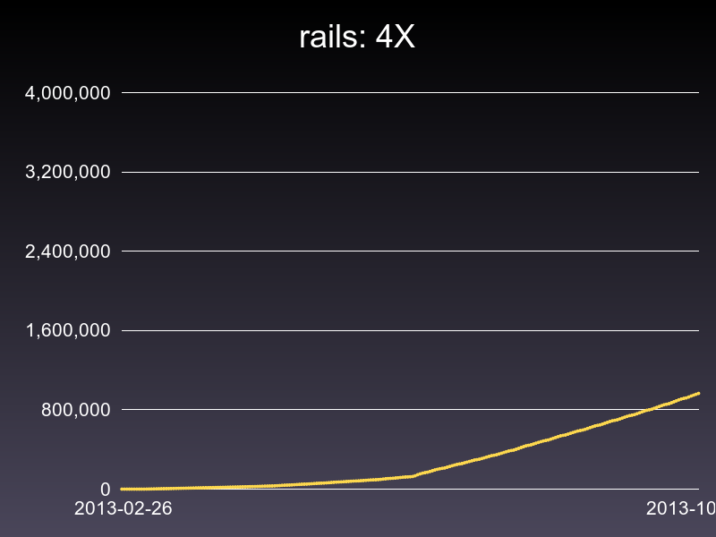

# GemVelocity

A way to see gem velocity. There are three ways you can view graphs. 

`AggregatedVelocitator`

`SingleVelocitator`

`MultipleVelocitator`

Some examples are noted below.

## Note

There may be some inconstancies. These are outlined in:

[https://gist.github.com/shaiguitar/d2af997b7f58e24fd305](https://gist.github.com/shaiguitar/d2af997b7f58e24fd305)

It seems it happens with older data. I'm investigating though with the help of the rubygems team as per [this](https://github.com/rubygems/rubygems.org/pull/606) and will hopefully have some progress soon.

## Requirements

It draws graphs. So...you'll need imagemagick/rmagick. Any problems with installation let me know and I'll try to help out.

There are plans to put it on the web somewhere, so if you wait long enough you may not even need to install it.

# Example

<pre>
  velocitator = MultipleVelocitator.new("rails", ["4.0.0","3.2.14","2.3.5"])
  file = velocitator.graph("/tmp")
</pre>

Produces:

Notice the date range:

<pre>
  velocitator = MultipleVelocitator.new("rails", ["4.0.0","3.2.14","0.9.1"])
  file = velocitator.graph("/tmp", [3.months.ago, Time.now])
</pre>

Produces:

<pre>
  velocitator = AggregatedVelocitator.new("rails", "4")
  # matches any version /^4.\d/ etc
  file = velocitator.graph("/tmp")
</pre>

Produces:

Another: [celluloid](https://gist.github.com/shaiguitar/7e6d95971c5254fa3665)

You could do the same with a `SingleVelocitator` as well: 

<pre>
  velocitator = SingleVelocitator.new("rails", "4.0.0")
  file = velocitator.graph("/tmp")
</pre>

That image is left as an excerise to the reader. Actually it's late. But try it and see.

Also, you should be able to pass in max,min values which completes you being able to manipulate the boundries of the graph in question.

## Web UI

Do you want to see this with ease (Hey, the api is easy. Whatever) on the web at `http://rubygems-velocity.org/gem/rails/4.0.0,3.2.14` or something similar? I could do it, but I need to know it's worth the hassle.

Also, if you have any idea of how you'd like to use it, please leave a comment on the [issue](https://github.com/shaiguitar/gem_velocities/issues/3)

Lemme know.

## Feedback

Is appreciated! Also, contributions! Any (other) ideas?
