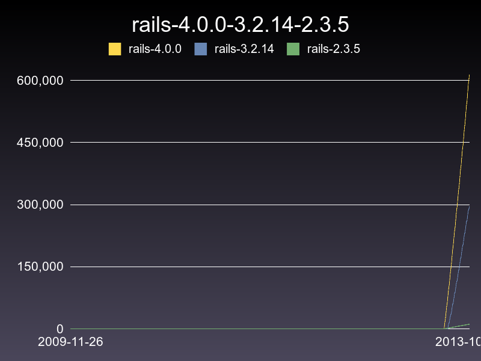
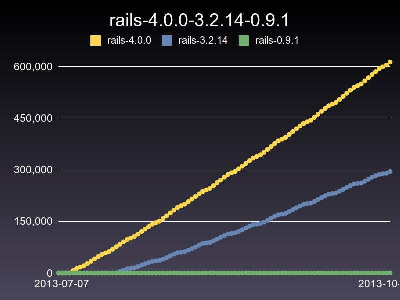

# GemVelocity

A way to see gem velocity. Right now it's just aggregated totals.

So, not a number of downloads each day, but rather just the general timeline of total downloads.

## Requirements

It draws graphs. So...you'll need imagemagick/rmagick. I'm sure you'll survive. Any problems with installation let me know and I'll try to help out.

# Example

This spec below:

<pre>
  it "has a shortcut graph method #1" do
    VCR.use_cassette('velocitator-rails-multiple-graph-shortcut-3') do
      velocitator = Velocitator.new("rails", ["4.0.0","3.2.14","2.3.5"])
      file = velocitator.graph("/tmp")
      File.exist?(file).should be_true
    end
  end
</pre>

Produces:

This spec below (notice the date range):

<pre>
  it "has a shortcut graph method #2" do
    VCR.use_cassette('velocitator-rails-multiple-graph-shortcut-4') do
      velocitator = Velocitator.new("rails", ["4.0.0","3.2.14","0.9.1"])
      file = velocitator.graph("/tmp", [3.months.ago, Time.now])
      File.exist?(file).should be_true
    end
  end
</pre>

Produces:

Also, you should be able to pass in max,min values to size the graph. See `spec/` for more info.
