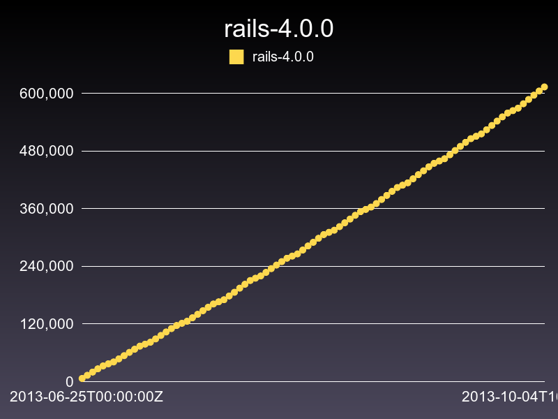

# GemVelocity

A way to see gem velocity. Right now it's just aggregated totals.

So, not a number of downloads each day, but rather just the general timeline of total downloads.

# Example

Should be able to do something like (api unstable, but the idea holds):

<pre>
velocitator = Coordinator.new("rails", "4.0.0")

# with a time period
file = velocitator.graph("/tmp/store", [1.day.ago, Time.now])
# use the defaults
file = velocitator.graph("/some/other/place")
# set a min and max value
file = velocitator.graph(nil,nil, 0, 1000)

</pre>

